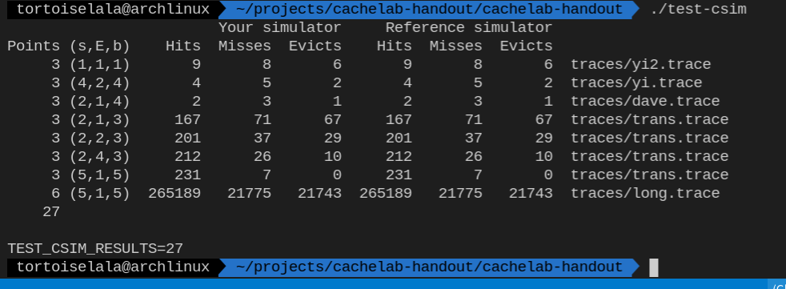
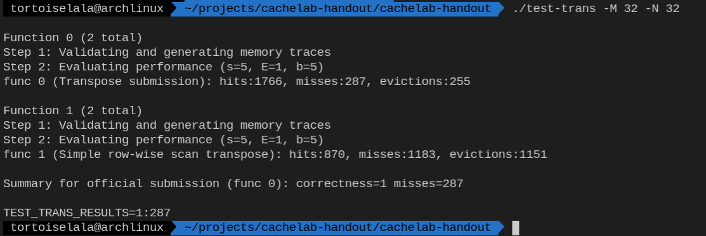
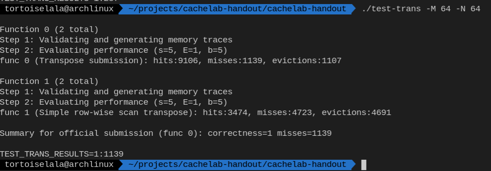
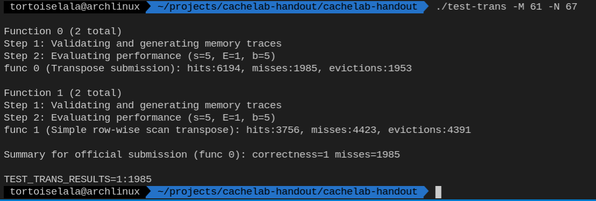

# 第一部分：Cache模拟器

## 实验目的
- 理解cache工作原理
- 加深cache缓存组成结构对c程序性能的影响的理解


## 实验环境
- 操作系统：linux 64 bit
- 编程语言：c
- 编译工具：gcc，make

## 实验思路
此实验要求编写完成数据包中的csim.c文件中的部分函数，以模拟cache缓存的行为。
实验框架给出的函数定义如下：
```c
initCache()
freeCache()
accessData(mem_addr_t addr)
replayTrace(char* trace_fn)
printUsage(char* argv[])
```
其中需要补全以达到实验功能的函数是：
- accessData
  该函数根据给出的地址判断是否命中，如果没有命中则寻找合适位置调入该数据。
- replayTrace
  该函数根据给出的文件名，读取该文件的内容，根据响应的指令调用指定的函数。
- freeCache
  该函数在程序执行完毕后，完成对cache内存的释放。

在开始补全这三个函数之前，首先分析该c程序是如何模拟cache的。在文件中定义了如下的数据结构：
```c
typedef struct cache_line {
    char valid;
    mem_addr_t tag;
    unsigned long long int lru;
} cache_line_t;

typedef cache_line_t* cache_set_t;
typedef cache_set_t* cache_t;
```
从注释及命名可以得知，`cache_line_t`为一个cache块，该cache块包含的三个属性及意义如下：
- `valid`
  cache块是否可用
- `tag`
  cache块标记
- `lru`
  cache块用于lru淘汰算法的计数器

使用`cache_set_t`标记cache块组织成为cache行，使用`cache_t`标记cache行组织成为cache。

该部分完成了对于一个使用lru算法的cache的定义。

对于该程序模拟的cache，访存行为定义如下：
- 命中：如果判断当前访问地址命中，则`hit`加1
- 缺失：如果判断当前访问地址缺失，则`miss`加1，并寻找空位置或可替换位置，如果需要提换则`eviction`加1

首先完成`freeCache`函数，该函数仅将用于cache的二维数组释放即可，代码如下：
```c
void freeCache() {  
    int i;  
    for (i = 0; i < S; ++i)  
        free(cache[i]);  
    free(cache);  
}  
```

接下来是`accessData`函数，实验框架给出了cache行与tag的计算过程如下：
```c
mem_addr_t set_index = (addr >> b) & set_index_mask;
mem_addr_t tag = addr >> (s + b);
cache_set_t cache_set = cache[set_index];
```

接下来要完成的仅仅是查找是否命中（tag位存在匹配），如果命中则更新该命中位置的lru计数器位0，同时将其他位置的lru计数器加1，代码如下：
```c
for (i = 0; i < E; ++i) {
        if (cache_set[i].valid && cache_set[i].tag == tag) {
            ++hit_count;
            for (int j = 0; j < E; ++j)
                if (cache_set[j].valid && cache_set[j].lru < cache_set[i].lru)
                    ++cache_set[j].lru;
            cache_set[i].lru = 0;
            return;
        }
    }
```

如果不命中则需要寻找空位置或替换某一位置，如下代码实现了寻找空位置与寻找替换位置，替换位置寻找的依据位lru算法（cache行中的lru计数器）：
```c
int j, maxIndex = 0;
unsigned long long maxLru = 0;
for (j = 0; j < E && cache_set[j].valid; ++j) {
    if (cache_set[j].lru >= maxLru) {
        maxLru = cache_set[j].lru;
        maxIndex = j;
    }
}

if (j != E) {
    for (int k = 0; k < E; ++k)
        if (cache_set[k].valid)
            ++cache_set[k].lru;
        cache_set[j].lru = 0;
        cache_set[j].valid = 1;
        cache_set[j].tag = tag;
    } else {
        ++eviction_count;
        for (int k = 0; k < E; ++k)
            ++cache_set[k].lru;
        cache_set[maxIndex].lru = 0;
        cache_set[maxIndex].tag = tag;
    }
```

最后需要完成的函数是replayTrace函数，该函数主要实现文件的格式化解析，并调用accessData即可，值得注意的是，由于M操作首次定会不命中，第二次一定命中，所以需要调用两次，实现代码如下：
```c
void replayTrace(char *trace_fn) {
    char buf[1000];
    mem_addr_t addr = 0;
    unsigned int len = 0;
    FILE *trace_fp = fopen(trace_fn, "r");

    int testcount = 0;

    while (fscanf(trace_fp, " %c %llx,%d", buf, &addr, &len) > 0) {
        if (verbosity && buf[0] != 'I')
            printf("%c %llx,%d ", buf[0], addr, len);
        switch (buf[0]) {
            case 'I':
                break;
            case 'L':
            case 'S':
                accessData(addr);
                ++testcount;
                break;
            case 'M':
                accessData(addr);
                accessData(addr);
                ++testcount;
                break;
            default:
                break;
        }
    }
    fclose(trace_fp);
}
```
## 实验结果和分析

依次执行以下命令：

```c
make clean
make
```

然后运行

```c
./test-csim
```

测试程序运行结果如所示：



<div align="center">图1.1 test-csim 运行结果</div>

可以看出程序通过了所有测试样例。

# 第二部分：矩阵转置优化

## 实验目的
- 理解cache工作原理
- 加深cache缓存组成结构对c程序性能的影响的理解

## 实验环境
- 操作系统：linux 64 bit
- 编程语言：c
- 编译工具：gcc，make
- 辅助工具：valgrind

## 实验思路

该部分实验需要完成函数`transpose_submit`函数以利用时间局部性和空间局部性来减少cache miss数。

在32×32的矩阵中，如果采用原矩阵进行转置，第一行转置的写入操作会发生24次eviction，此后每一行的转置对应的写入都会发生32次eviction，加上两个矩阵同一行冲突以及读取时发生的冲突，一共会发生1184次cache miss。
$$
\begin{bmatrix}
A & B\\
C & D\\
\end{bmatrix}
^T
=
\begin{bmatrix}
A^T & B^T\\
C^T & D^T\\
\end{bmatrix}
$$
由于上述表达式的存在，可以将大矩阵转置通过小矩阵转置来实现，从而充分利用时间局部性与空间局部性。

可以尝试不同的分法，分别测试其最终能够达到的分数，选取最优即可。

对于64×64的矩阵与61×67的矩阵，同样测试不同情况下矩阵的划分，选取最优即可。

最终实现的代码如下所示：

```c
void transpose_submit(int M, int N, int A[N][M], int B[M][N])
{  int a, b, c, d;
    int reg0, reg1, reg2, reg3, reg4, reg5, reg6, reg7;
    if (M == 32 && N == 32) {
        for (a = 0; a < N; a += 8) {
            for (b = 0; b < M; b += 8) {
                for (c = a; c < a + 8; ++c) {
                    reg0 = A[c][b + 0];
                    reg1 = A[c][b + 1];
                    reg2 = A[c][b + 2];
                    reg3 = A[c][b + 3];
                    reg4 = A[c][b + 4];
                    reg5 = A[c][b + 5];
                    reg6 = A[c][b + 6];
                    reg7 = A[c][b + 7];
                    B[b + 0][c] = reg0;
                    B[b + 1][c] = reg1;
                    B[b + 2][c] = reg2;
                    B[b + 3][c] = reg3;
                    B[b + 4][c] = reg4;
                    B[b + 5][c] = reg5;
                    B[b + 6][c] = reg6;
                    B[b + 7][c] = reg7;
                }
            }
        }
    } else if (M == 64 && N == 64) {
        for (a = 0; a < N; a += 8) {
            for (b = 0; b < M; b += 8) {
                for (c = a; c < a + 4; ++c) {
                    reg0 = A[c][b + 0];
                    reg1 = A[c][b + 1];
                    reg2 = A[c][b + 2];
                    reg3 = A[c][b + 3];
                    reg4 = A[c][b + 4];
                    reg5 = A[c][b + 5];
                    reg6 = A[c][b + 6];
                    reg7 = A[c][b + 7];
                    B[b + 0][c] = reg0;
                    B[b + 0][c + 4] = reg4;
                    B[b + 1][c] = reg1;
                    B[b + 1][c + 4] = reg5;
                    B[b + 2][c] = reg2;
                    B[b + 2][c + 4] = reg6;
                    B[b + 3][c] = reg3;
                    B[b + 3][c + 4] = reg7;
                }
                for (c = 0; c < 4; ++c) {
                    reg0 = A[a + 4][b + c];
                    reg1 = A[a + 5][b + c];
                    reg2 = A[a + 6][b + c];
                    reg3 = A[a + 7][b + c];
                    reg4 = B[b + c][a + 4];
                    reg5 = B[b + c][a + 5];
                    reg6 = B[b + c][a + 6];
                    reg7 = B[b + c][a + 7];
                    B[b + c][a + 4] = reg0;
                    B[b + c][a + 5] = reg1;
                    B[b + c][a + 6] = reg2;
                    B[b + c][a + 7] = reg3;
                    reg0 = A[a + 4][b + c + 4];
                    reg1 = A[a + 5][b + c + 4];
                    reg2 = A[a + 6][b + c + 4];
                    reg3 = A[a + 7][b + c + 4];
                    B[b + c + 4][a + 0] = reg4;
                    B[b + c + 4][a + 4] = reg0;
                    B[b + c + 4][a + 1] = reg5;
                    B[b + c + 4][a + 5] = reg1;
                    B[b + c + 4][a + 2] = reg6;
                    B[b + c + 4][a + 6] = reg2;
                    B[b + c + 4][a + 3] = reg7;
                    B[b + c + 4][a + 7] = reg3;
                }
            }
        }
    } else if (M == 61 && N == 67) {
        for (a = 0; a < N; a += 23)
            for (b = 0;  b < M; b += 23)
                for (c = a; c < a + 23 && c < N; ++c)
                    for (d = b; d < b + 23 && d < M; ++d)
                        B[d][c] = A[c][d];
    }
}
```

## 实验结果和分析

执行以下命令，重新生成目标文件：

```c
make clean
make
```

执行32×32矩阵转置测试：

```shell
./test-trans -M 32 -N 32
```

执行结果如所示：



结果287小于300，满足条件。

执行64×64矩阵测试：

```shell
./test-trans -M 64 -N 64
```

执行结果如所示：



结果1139小于1300，满足条件。

执行61×67矩阵测试：

```shell
./test-trans -M 61 -N 67
```

执行结果如所示：



结果1985小于2000，满足条件。

# 总结和体会

此次实验过后，我对于cache的结构与cache的工作原理有了更深入的了解。在调试过程中，我对组相连的工作方式以及lru算法有了更加深入的认识。

# 对实验课程的改进建议

在开始看实验介绍ppt时，发现其中某些部分解释的不是很清楚，之后与同学探讨过后才明白其意义，比如实验一中关于从文件读取的访存轨迹的解析，在看到关于四种指令的解释时，并不是很懂其正真含义，在综合实验材料以及网上搜索得到的结果才最终明了。希望能够调整一下实验文档的顺序，将基础性的内容放在前面介绍（比如lru的部分）。